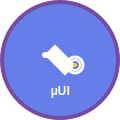

<div align="center">



# 🔧 MicroUI

### Pure Vanilla JavaScript Utility Library

[](https://www.npmjs.com/package/microui)
[](https://bundlephobia.com/package/microui)
[](https://github.com/lam0819/MicroUI/blob/master/LICENSE)
[](https://github.com/lam0819/MicroUI/stargazers)

[](https://developer.mozilla.org/en-US/docs/Web/JavaScript)
[](https://www.npmjs.com/package/microui)
[](https://www.typescriptlang.org/)
[](https://www.ecma-international.org/ecma-262/)

---

**🌟 A lightweight, pure vanilla JavaScript utility library that makes DOM manipulation and event handling simple and efficient. 🌟**

**6x smaller than jQuery • Zero dependencies • Modern ES6+ • Performance optimized**

### 🚀 Quick Start

```bash
npm install microui
```

```html
<script src="https://unpkg.com/microui@latest/dist/microui.min.js"></script>
```

### 🎮 [**Live Demo & Documentation**](https://lam0819.github.io/MicroUI) | 📚 [**API Reference**](#api-reference) | 🧪 [**Interactive Examples**](https://lam0819.github.io/MicroUI/examples/)

[Why Vanilla JS?](#why-vanilla-js) • [Performance](#performance) • [Examples](#examples) • [Advanced Examples](examples/advanced-interactive.html) • [Contributing](#contributing)

</div>

## 🚀 Features

- **Pure Vanilla JS**: Zero dependencies, no frameworks, just native JavaScript
- **Ultra Lightweight**: Only 18.6KB minified (5.2KB gzipped) - 6x smaller than jQuery
- **Modern**: Built with ES6+ features and Promise-based APIs
- **Fast**: Event delegation by default, optimized for performance
- **Complete**: Includes DOM manipulation, AJAX, animations, components, and more
- **Simple**: Clean, intuitive API that's easy to learn
- **No Build Required**: Drop in a script tag and start coding

## 🤔 Why Vanilla JS?

### 🚀 Quick Start

Modern web development has become unnecessarily complex. While frameworks like React, Vue, and Angular are powerful, they often introduce:

- **Build Complexity**: Webpack, Babel, and countless dependencies
- **Bundle Bloat**: Megabytes of JavaScript for simple interactions
- **Learning Overhead**: New syntax, concepts, and paradigms
- **Runtime Overhead**: Virtual DOM diffing and framework abstractions

### 🚀 Quick Start

jQuery revolutionized web development by making DOM manipulation simple and cross-browser compatible. However:

- **Outdated**: Built for IE6 era, carries legacy baggage
- **Large**: 87KB minified, 30KB gzipped - too heavy for modern needs
- **Monolithic**: Can't tree-shake unused features
- **Not Modern**: No ES6+, Promises, or modern JavaScript features

### 🚀 Quick Start

**"Maximum functionality, minimum complexity"**

MicroUI brings back the simplicity of jQuery while embracing modern JavaScript:

```javascript
// jQuery way (2006)
$(document).ready(function() {
  $('.button').click(function() {
    $(this).addClass('clicked');
  });
});

// MicroUI way (2024)
MicroUI.ready(() => {
  MicroUI.on('click', '.button', function() {
    MicroUI.addClass(this, 'clicked');
  });
});
```

### 🚀 Quick Start

**No frameworks. No dependencies. Just JavaScript.**

MicroUI is built entirely with native browser APIs, making it:

#### 🚀 Quick Start
- **No Virtual DOM**: Direct DOM manipulation is faster for most use cases
- **Zero Runtime Overhead**: No framework initialization or abstractions
- **Native Speed**: Direct access to browser APIs without wrappers
- **Memory Efficient**: No framework memory footprint

#### 🚀 Quick Start
- **Familiar API**: If you know jQuery, you know MicroUI
- **Modern Features**: Promises, async/await, ES6+ syntax
- **TypeScript Ready**: Full type definitions included
- **No Build Required**: Drop in a script tag and start coding

#### 🚀 Quick Start
- **Web Standards**: Built on stable browser APIs
- **Framework Agnostic**: Use with React, Vue, or anything
- **Future Proof**: Vanilla JavaScript never goes out of style
- **Zero Breaking Changes**: Stable API you can depend on

### 🚀 Quick Start

| Feature | MicroUI | jQuery | React | Alpine.js | Vanilla JS |
|---------|---------|--------|-------|-----------|------------|
| **Bundle Size** | 5.2KB gzipped | 30KB gzipped | 42KB+ gzipped | 15KB gzipped | 0KB |
| **Learning Curve** | ⭐⭐ Easy | ⭐⭐ Easy | ⭐⭐⭐⭐⭐ Steep | ⭐⭐⭐ Medium | ⭐⭐⭐⭐ Hard |
| **Build Required** | ❌ Optional | ❌ No | ✅ Yes | ❌ No | ❌ No |
| **Modern Syntax** | ✅ ES6+ | ❌ ES5 | ✅ JSX | ✅ ES6+ | ✅ Native |
| **Component System** | ✅ Built-in | ❌ Plugins | ✅ Core | ✅ Directives | ❌ Manual |
| **Event Delegation** | ✅ Default | ✅ Manual | ❌ Manual | ✅ Auto | ❌ Manual |
| **Animation API** | ✅ Web Animations | ❌ CSS only | ❌ CSS/Libraries | ❌ CSS only | ✅ Native |
| **AJAX Promises** | ✅ Native | ❌ Custom | ❌ External | ❌ Fetch | ✅ Native |
| **TypeScript** | ✅ Included | ⭐ Community | ✅ First-class | ❌ Limited | ✅ Native |

### 🚀 Quick Start

#### 🚀 Quick Start
- **Content Websites**: Blogs, marketing sites, documentation
- **E-commerce**: Product pages, shopping carts, checkout flows
- **Dashboards**: Admin panels, analytics interfaces
- **Progressive Enhancement**: Adding interactivity to existing sites
- **Prototyping**: Quick experiments and proof of concepts
- **Team Onboarding**: Easy for junior developers to understand

#### 🚀 Quick Start
- **Complex SPAs**: Applications with heavy state management
- **Real-time Apps**: Chat applications, collaborative tools
- **Data-Heavy UIs**: Large tables, complex visualizations
- **Team Standardization**: If your team is already invested in a framework

### 🚀 Quick Start

```javascript
// Traditional Framework Component
function TodoApp() {
  const [todos, setTodos] = useState([]);
  const [inputValue, setInputValue] = useState('');
  
  const addTodo = useCallback(() => {
    setTodos(prev => [...prev, { id: Date.now(), text: inputValue }]);
    setInputValue('');
  }, [inputValue]);
  
  return (
    <div>
      <input 
        value={inputValue} 
        onChange={e => setInputValue(e.target.value)}
        onKeyPress={e => e.key === 'Enter' && addTodo()}
      />
      <button onClick={addTodo}>Add</button>
      {todos.map(todo => (
        <div key={todo.id}>{todo.text}</div>
      ))}
    </div>
  );
}

// MicroUI Component
MicroUI.component('todo-app', {
  template: `
    <div>
      <input class="todo-input" placeholder="Add todo...">
      <button class="add-btn">Add</button>
      <div class="todos"></div>
    </div>
  `,
  
  events: {
    'click .add-btn': 'addTodo',
    'keypress .todo-input': function(e) {
      if (e.key === 'Enter') this.methods.addTodo();
    }
  },
  
  methods: {
    addTodo() {
      const input = MicroUI.$('.todo-input');
      const text = input.value.trim();
      if (text) {
        MicroUI.append('.todos', `<div>${text}</div>`);
        input.value = '';
      }
    }
  }
});
```

**Performance Benefits:**
- **Faster Initial Load**: Smaller bundle = quicker downloads and parsing
- **Lower Memory Usage**: No framework overhead, minimal runtime footprint  
- **Better Mobile Performance**: Less JavaScript to parse and execute
- **Improved Core Web Vitals**: Smaller bundles improve Lighthouse scores

## 📈 Performance

MicroUI delivers exceptional performance through modern optimization techniques:

### 🚀 Quick Start
```bash
# Production Build Sizes (Automated via GitHub Actions)
Original:     ~75KB (source code)
Minified:     18KB (75% reduction)
Gzipped:      5.2KB (93% reduction)

# Comparison with Popular Libraries (Gzipped)
jQuery 3.7:   30KB (5.8x larger)
React 18:     13KB (2.5x larger)  
Vue 3:        16KB (3.1x larger)
Alpine.js:    15KB (2.9x larger)
```

### 🚀 Quick Start
- **Event Delegation**: All events use delegation by default (faster than direct binding)
- **DOM Optimization**: Smart caching and batched operations
- **Memory Efficient**: Minimal memory footprint with automatic cleanup
- **Native APIs**: Direct browser API usage for maximum speed
- **Tree Shakable**: Import only the modules you need

### 🚀 Quick Start
MicroUI prioritizes performance through:
- **Zero Dependencies**: No framework overhead or initialization cost
- **Small Bundle Size**: 5.2KB gzipped means faster downloads and parsing
- **Native JavaScript**: Direct browser API access without abstractions
- **Event Delegation**: Efficient event handling for dynamic content
- **Minimal Overhead**: Direct DOM manipulation without virtual DOM diffing

### 🚀 Quick Start
```bash
# Download time on different connections
MicroUI (5.2KB gzipped):
  - Fast 3G: ~51ms
  - Slow 3G: ~170ms
  - 2G: ~680ms

jQuery (30KB gzipped):
  - Fast 3G: ~300ms  
  - Slow 3G: ~1000ms
  - 2G: ~4000ms
```

### 🚀 Quick Start
- **User Experience**: Faster loading = better user engagement
- **SEO Benefits**: Google factors page speed into search rankings
- **Mobile Performance**: Critical for slower devices and networks
- **Developer Productivity**: Less build time, faster development cycles
- **Hosting Costs**: Smaller bundles = less bandwidth = lower costs

## 📦 Installation

### 🚀 Quick Start
```bash
npm install microui
```

### 🚀 Quick Start
```html
<!-- Development -->
<script src="https://unpkg.com/microui@1.0.0/dist/microui.js"></script>

<!-- Production -->
<script src="https://unpkg.com/microui@1.0.0/dist/microui.min.js"></script>
```

### 🚀 Quick Start
Download the latest release from [GitHub Releases](https://github.com/lam0819/microui/releases)

## 🏃 Quick Start

```html
<!DOCTYPE html>
<html>
<head>
  <script src="microui.min.js"></script>
</head>
<body>
  <button class="my-button">Click me!</button>
  
  <script>
    // DOM ready
    MicroUI.ready(() => {
      // Event handling
      MicroUI.on('click', '.my-button', function() {
        this.textContent = 'Clicked!';
        
        // AJAX request
        MicroUI.get('/api/data')
          .then(data => console.log(data));
      });
    });
  </script>
</body>
</html>
```

## 📖 Documentation

### 🚀 Quick Start

MicroUI is built around a few core principles:

1. **Event Delegation**: All events use delegation for better performance
2. **Promise-Based**: All async operations return Promises
3. **Modular**: Use only what you need
4. **Vanilla JS**: No new syntax or compilation required

### 🚀 Quick Start

#### 🚀 Quick Start
```javascript
MicroUI.ready(() => {
  console.log('DOM is ready!');
});
```

#### 🚀 Quick Start
```javascript
// Basic event
MicroUI.on('click', '.button', function(e) {
  console.log('Clicked:', this);
});

// Multiple events
MicroUI.on('mouseenter mouseleave', '.hover', function(e) {
  this.classList.toggle('active');
});

// One-time event
MicroUI.once('click', '.one-time', function() {
  console.log('This only fires once');
});

// Remove events
MicroUI.off('click', '.button');
```

#### 🚀 Quick Start
```javascript
// Query elements
const element = MicroUI.$('.my-element');
const elements = MicroUI.$$('.all-elements');

// Manipulate classes
MicroUI.addClass(element, 'active highlight');
MicroUI.removeClass(element, 'inactive');
MicroUI.toggleClass(element, 'visible');

// Insert content
MicroUI.append('.container', '<div>New content</div>');
MicroUI.prepend('.container', '<div>First content</div>');
MicroUI.html('.container', '<p>Replace all content</p>');

// Attributes and data
MicroUI.attr(element, 'id', 'my-id');
MicroUI.data(element, 'user', { name: 'John', age: 30 });
```

#### 🚀 Quick Start
```javascript
// GET request
MicroUI.get('/api/users')
  .then(users => console.log(users))
  .catch(error => console.error(error));

// POST request
MicroUI.post('/api/users', {
  name: 'John Doe',
  email: 'john@example.com'
}).then(response => console.log(response));

// Load HTML
MicroUI.load('.content', '/partial.html');
```

#### 🚀 Quick Start
```javascript
// Fade effects
MicroUI.fadeIn('.element', 300);
MicroUI.fadeOut('.element', 300, () => console.log('Fade complete'));

// Slide effects
MicroUI.slideDown('.dropdown', 400);
MicroUI.slideUp('.dropdown', 400);

// Custom animation
MicroUI.animate('.box', {
  transform: ['translateX(0)', 'translateX(100px)'],
  opacity: [1, 0.5]
}, {
  duration: 500,
  easing: 'ease-out'
});
```

## 🛠️ API Reference

### 🚀 Quick Start

#### 🚀 Quick Start
Attach an event handler using delegation.

```javascript
MicroUI.on('click', '.button', function(e) {
  console.log('Clicked:', this);
});
```

#### 🚀 Quick Start
Remove event handlers.

```javascript
MicroUI.off('click', '.button');
```

#### 🚀 Quick Start
Attach a handler that fires only once.

```javascript
MicroUI.once('submit', '.form', function(e) {
  e.preventDefault();
  console.log('Form submitted once');
});
```

#### 🚀 Quick Start
Trigger a custom event.

```javascript
MicroUI.trigger('.element', 'customEvent', { value: 42 });
```

### 🚀 Quick Start

#### 🚀 Quick Start
Query single element (with caching).

```javascript
const header = MicroUI.$('.header');
```

#### 🚀 Quick Start
Query multiple elements.

```javascript
const buttons = MicroUI.$$('.button');
```

#### 🚀 Quick Start
Add one or more classes.

```javascript
MicroUI.addClass(element, 'active highlight');
```

#### 🚀 Quick Start
Remove one or more classes.

```javascript
MicroUI.removeClass(element, 'inactive');
```

#### 🚀 Quick Start
Toggle a class.

```javascript
MicroUI.toggleClass(element, 'visible');
```

#### 🚀 Quick Start
Check if element has class.

```javascript
if (MicroUI.hasClass(element, 'active')) {
  // ...
}
```

### 🚀 Quick Start

#### 🚀 Quick Start
Perform GET request.

```javascript
MicroUI.get('/api/data', {
  headers: { 'Authorization': 'Bearer token' }
}).then(data => console.log(data));
```

#### 🚀 Quick Start
Perform POST request.

```javascript
MicroUI.post('/api/users', { name: 'John' })
  .then(response => console.log(response));
```

#### 🚀 Quick Start
Generic AJAX request.

```javascript
MicroUI.ajax({
  url: '/api/data',
  method: 'PUT',
  data: { id: 1, name: 'Updated' },
  headers: { 'Content-Type': 'application/json' }
}).then(response => console.log(response));
```

### 🚀 Quick Start

#### 🚀 Quick Start
Fade in an element.

```javascript
MicroUI.fadeIn('.modal', 300, () => {
  console.log('Fade in complete');
});
```

#### 🚀 Quick Start
Fade out an element.

```javascript
MicroUI.fadeOut('.modal', 300);
```

#### 🚀 Quick Start
Slide down animation.

```javascript
MicroUI.slideDown('.dropdown', 400);
```

#### 🚀 Quick Start
Custom animation using Web Animations API.

```javascript
MicroUI.animate('.box', {
  transform: ['scale(1)', 'scale(1.2)', 'scale(1)'],
  opacity: [1, 0.8, 1]
}, {
  duration: 1000,
  iterations: Infinity
});
```

### 🚀 Quick Start

#### 🚀 Quick Start
Create debounced function.

```javascript
const search = MicroUI.debounce((query) => {
  console.log('Searching:', query);
}, 300);
```

#### 🚀 Quick Start
Create throttled function.

```javascript
const handleScroll = MicroUI.throttle(() => {
  console.log('Scrolling');
}, 100);
```

#### 🚀 Quick Start
Merge objects.

```javascript
const config = MicroUI.extend({}, defaults, userOptions);
```

### 🚀 Quick Start

#### 🚀 Quick Start
LocalStorage wrapper.

```javascript
// Set
MicroUI.store.set('user', { name: 'John', age: 30 });

// Get
const user = MicroUI.store.get('user');

// Remove
MicroUI.store.remove('user');

// Clear all
MicroUI.store.clear();
```

#### 🚀 Quick Start
SessionStorage wrapper.

```javascript
MicroUI.session.set('token', 'abc123');
const token = MicroUI.session.get('token');
```

### 🚀 Quick Start

#### 🚀 Quick Start
Create reusable component.

```javascript
MicroUI.component('counter', {
  template: `
    <div class="counter">
      <button class="dec">-</button>
      <span class="value">{{count}}</span>
      <button class="inc">+</button>
    </div>
  `,
  
  state: {
    count: 0
  },
  
  methods: {
    increment() {
      this.state.count++;
      this.update();
    },
    decrement() {
      this.state.count--;
      this.update();
    }
  },
  
  events: {
    'click .inc': 'increment',
    'click .dec': 'decrement'
  },
  
  lifecycle: {
    created() {
      console.log('Component created');
    },
    mounted() {
      console.log('Component mounted');
    }
  }
});

// Mount component
MicroUI.mount('.app', 'counter', { count: 10 });
```

### 🚀 Quick Start

#### 🚀 Quick Start
Create event delegation namespace.

```javascript
const cart = MicroUI.delegate('shoppingCart', {
  'click .add-to-cart': function(e) {
    console.log('Adding to cart');
  },
  'click .remove-item': function(e) {
    console.log('Removing item');
  }
});

// Add more handlers
cart.on('click', '.checkout', handleCheckout);

// Remove handlers
cart.off('click', '.add-to-cart');

// Destroy all
cart.destroy();
```

## 📁 Project Structure

```
microui/
├── dist/
│   ├── microui.js         # Development build
│   ├── microui.min.js     # Production build
│   └── microui.esm.js     # ES Module build
├── src/
│   ├── core/
│   │   ├── dom.js         # DOM utilities
│   │   ├── events.js      # Event system
│   │   ├── ajax.js        # AJAX utilities
│   │   └── utils.js       # Helper functions
│   ├── modules/
│   │   ├── animation.js   # Animation module
│   │   ├── storage.js     # Storage utilities
│   │   ├── component.js   # Component system
│   │   └── delegate.js    # Delegation system
│   └── index.js           # Main entry point
├── examples/
│   ├── basic.html         # Basic examples
│   └── advanced.html      # Advanced UI components (tabs, modals, dropdowns)
├── tests/
│   ├── dom.test.js
│   ├── events.test.js
│   └── ajax.test.js
├── llms.txt               # LLM-friendly codebase documentation
├── package.json
├── rollup.config.js       # Build configuration
├── README.md
└── LICENSE
```

## 🔧 Building from Source

### 🚀 Quick Start
- Node.js 14+
- npm or yarn

### 🚀 Quick Start
```bash
# Clone repository
git clone https://github.com/lam0819/microui.git
cd microui

# Install dependencies
npm install

# Development build
npm run build:dev

# Production build
npm run build

# Watch mode
npm run watch

# Run tests
npm test

# Run examples server
npm run serve
```

### 🚀 Quick Start

The project uses Rollup for building:

```javascript
// rollup.config.js
import { terser } from 'rollup-plugin-terser';
import babel from '@rollup/plugin-babel';

export default [
  // Development build
  {
    input: 'src/index.js',
    output: {
      file: 'dist/microui.js',
      format: 'umd',
      name: 'MicroUI'
    },
    plugins: [
      babel({ babelHelpers: 'bundled' })
    ]
  },
  // Production build
  {
    input: 'src/index.js',
    output: {
      file: 'dist/microui.min.js',
      format: 'umd',
      name: 'MicroUI'
    },
    plugins: [
      babel({ babelHelpers: 'bundled' }),
      terser()
    ]
  },
  // ES Module build
  {
    input: 'src/index.js',
    output: {
      file: 'dist/microui.esm.js',
      format: 'es'
    },
    plugins: [
      babel({ babelHelpers: 'bundled' })
    ]
  }
];
```

## 🧪 Testing

```bash
# Run all tests
npm test

# Run specific test file
npm test dom.test.js

# Run with coverage
npm run test:coverage

# Watch mode
npm run test:watch
```

### 🚀 Quick Start

```javascript
// tests/dom.test.js
import { describe, it, expect } from '@jest/globals';
import MicroUI from '../src/index.js';

describe('DOM Utilities', () => {
  it('should add classes', () => {
    const element = document.createElement('div');
    MicroUI.addClass(element, 'active highlight');
    
    expect(element.classList.contains('active')).toBe(true);
    expect(element.classList.contains('highlight')).toBe(true);
  });
  
  it('should query elements', () => {
    document.body.innerHTML = '<div class="test"></div>';
    const element = MicroUI.$('.test');
    
    expect(element).toBeTruthy();
    expect(element.className).toBe('test');
  });
});
```

## 💡 Examples

### 🚀 Quick Start
- **[Interactive Demo Site](https://lam0819.github.io/microui)** - Complete showcase with all features
- **[Basic Examples](examples/basic.html)** - Core functionality demonstrations  
- **[Advanced Components](examples/advanced.html)** - Tabs, modals, dropdowns, accordions, and more

### 🚀 Quick Start

```html
<!DOCTYPE html>
<html>
<head>
  <script src="microui.min.js"></script>
  <style>
    .todo { padding: 10px; margin: 5px; background: #f0f0f0; }
    .todo.completed { opacity: 0.5; text-decoration: line-through; }
  </style>
</head>
<body>
  <div class="app">
    <h1>Todo List</h1>
    <form class="todo-form">
      <input type="text" class="todo-input" placeholder="Add todo...">
      <button type="submit">Add</button>
    </form>
    <div class="todos"></div>
  </div>

  <script>
    MicroUI.ready(() => {
      // Handle form submission
      MicroUI.on('submit', '.todo-form', function(e) {
        e.preventDefault();
        
        const input = MicroUI.$('.todo-input');
        const text = input.value.trim();
        
        if (text) {
          const todoId = Date.now();
          MicroUI.append('.todos', `
            <div class="todo" data-id="${todoId}">
              <input type="checkbox" class="todo-check">
              <span class="todo-text">${text}</span>
              <button class="todo-delete">Delete</button>
            </div>
          `);
          
          input.value = '';
          
          // Save to storage
          const todos = MicroUI.store.get('todos') || [];
          todos.push({ id: todoId, text, completed: false });
          MicroUI.store.set('todos', todos);
        }
      });
      
      // Handle checkbox
      MicroUI.on('change', '.todo-check', function() {
        const todo = MicroUI.closest(this, '.todo');
        MicroUI.toggleClass(todo, 'completed', this.checked);
        
        // Update storage
        const todoId = parseInt(todo.dataset.id);
        const todos = MicroUI.store.get('todos') || [];
        const index = todos.findIndex(t => t.id === todoId);
        if (index !== -1) {
          todos[index].completed = this.checked;
          MicroUI.store.set('todos', todos);
        }
      });
      
      // Handle delete
      MicroUI.on('click', '.todo-delete', function() {
        const todo = MicroUI.closest(this, '.todo');
        const todoId = parseInt(todo.dataset.id);
        
        // Fade out and remove
        MicroUI.fadeOut(todo, 300, () => {
          MicroUI.remove(todo);
          
          // Update storage
          let todos = MicroUI.store.get('todos') || [];
          todos = todos.filter(t => t.id !== todoId);
          MicroUI.store.set('todos', todos);
        });
      });
      
      // Load saved todos
      const savedTodos = MicroUI.store.get('todos') || [];
      savedTodos.forEach(todo => {
        MicroUI.append('.todos', `
          <div class="todo ${todo.completed ? 'completed' : ''}" data-id="${todo.id}">
            <input type="checkbox" class="todo-check" ${todo.completed ? 'checked' : ''}>
            <span class="todo-text">${todo.text}</span>
            <button class="todo-delete">Delete</button>
          </div>
        `);
      });
    });
  </script>
</body>
</html>
```

### 🚀 Quick Start

```html
<!DOCTYPE html>
<html>
<head>
  <script src="microui.min.js"></script>
</head>
<body>
  <div id="app"></div>

  <script>
    // Define counter component
    MicroUI.component('counter', {
      template: `
        <div class="counter" style="padding: 20px; border: 1px solid #ddd; margin: 10px;">
          <h3>{{title}}</h3>
          <button class="dec">-</button>
          <span style="margin: 0 20px; font-size: 24px;">{{count}}</span>
          <button class="inc">+</button>
          <button class="reset">Reset</button>
        </div>
      `,
      
      props: {
        title: 'Counter',
        initial: 0
      },
      
      state: {
        count: 0
      },
      
      methods: {
        increment() {
          this.state.count++;
          this.update();
        },
        decrement() {
          this.state.count--;
          this.update();
        },
        reset() {
          this.state.count = this.props.initial;
          this.update();
        }
      },
      
      events: {
        'click .inc': 'increment',
        'click .dec': 'decrement',
        'click .reset': 'reset'
      },
      
      lifecycle: {
        created() {
          this.state.count = this.props.initial;
        }
      }
    });
    
    // Mount multiple counters
    MicroUI.mount('#app', 'counter', { title: 'Products', initial: 0 });
    MicroUI.mount('#app', 'counter', { title: 'Users', initial: 100 });
    MicroUI.mount('#app', 'counter', { title: 'Orders', initial: 50 });
  </script>
</body>
</html>
```

## 🤝 Contributing

We welcome contributions! Please see our [Contributing Guide](CONTRIBUTING.md) for details.

### 🚀 Quick Start

1. Fork the repository
2. Create a feature branch: `git checkout -b feature/my-feature`
3. Make your changes
4. Add tests for new functionality
5. Run tests: `npm test`
6. Commit changes: `git commit -m "Add my feature"`
7. Push to branch: `git push origin feature/my-feature`
8. Submit a pull request

### 🚀 Quick Start

- Use ES6+ features
- Follow ESLint configuration
- Add JSDoc comments for public APIs
- Keep functions small and focused
- Write tests for new features

### 🚀 Quick Start

- Update README.md for user-facing changes
- Update `llms.txt` for codebase architecture changes
- Add examples for new features
- Include JSDoc comments for all public APIs

## 📄 License

MIT License - see [LICENSE](LICENSE) file for details.

## 🙏 Credits

Created by [MicroUI](https://github.com/lam0819)

Inspired by jQuery's simplicity and modern JavaScript best practices.

## 🔗 Links

- [Documentation](https://microui.dev)
- [GitHub Repository](https://github.com/lam0819/microui)
- [NPM Package](https://www.npmjs.com/package/microui)
- [Examples](https://microui.dev/examples)
- [Changelog](CHANGELOG.md)

---

<div align="center">
  Made with ❤️ by the MicroUI team
</div>
